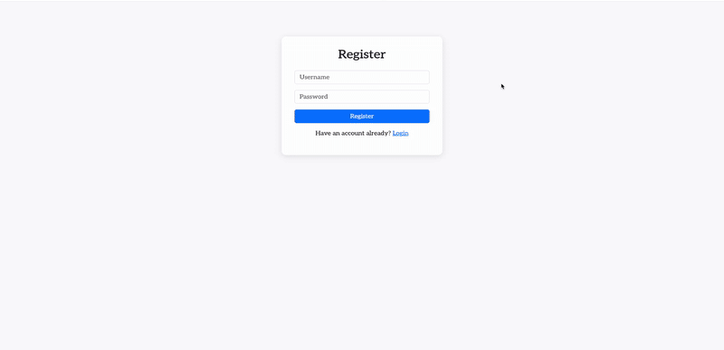

# 🕹️ Game Hub

Game Hub is a full-stack web app where users can play:
- **🪨 Rock Paper Scissors** with AI that analyzes their history
- **🧐 Trivia** powered by AI-generated questions  
All gameplay is done through **your webcam** (no buttons to pick moves!).

> Built with Flask, MongoDB, OpenAI Vision, and Docker containers for modular services.

---

## 🚀 Features

- 🔐 **User Authentication**
- 🤖 Rock Paper Scissors that learns your patterns (Naive Bayes)
- 🧠 Trivia with AI-generated questions and scoring
- 📷 **Camera-based gameplay** (Rock/Paper/Scissors detected visually)
- 📊 Match history & win/loss tracking
- 🐳 Multi-container Docker setup (web app, ML model, MongoDB)

---

## 🛠️ Technologies

- Python / Flask
- OpenAI Vision API (`gpt-4o`)
- MongoDB (hosted or local)
- Docker + Docker Compose
- Bootstrap 5 (for responsive UI)

